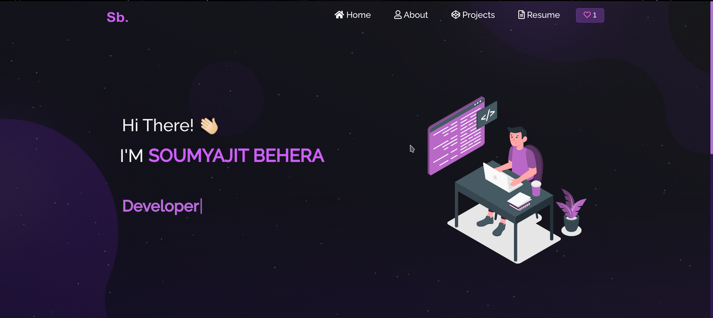

## Introduction

<h2 align="center">
  Portfolio Website 
  <a href="https://soumyajit.vercel.app/" target="_blank">soumyajit.tech</a>
</h2>

  

 

Personal portfolio website built using React.js, migrated from Create React App (CRA) to Vite for improved performance, originally based on the project by [Soumyajit4419](https://github.com/soumyajit4419/Portfolio).

Vite offers **faster build times, instant hot module replacement**, and a modern development experience compared to the decades-old CRA, ensuring a smoother and more efficient workflow for today’s web applications

Feel free to fork this repository to customize it according to your needs. If you do, please provide proper credit by linking back to [Faraz-Ansari](https://github.com/Faraz-Ansari/portfolio). Thank you!

## Built With

This portfolio website, available at <a href="https://soumyajit.vercel.app/" target="_blank">soumyajit.tech</a>, showcases some of my GitHub projects, resume, and technical skills. 

The project was built using the following technologies:

-   React.js
-   CSS3
-   VS Code
-   Vercel

## Features

-   **📖 Multi-Page Layout**
-   **🎨 Styled with React-Bootstrap and CSS, with customizable colors**
-   **📱 Fully Responsive**

## Getting Started

To get started, clone this repository. You will need `node.js` and `git` installed globally on your machine.

## Installation and Setup Instructions

1. Install dependencies: `npm install`

2. Run the development server: `npm run dev`

    This command starts the app in development mode.\
    Open [http://localhost:5173](http://localhost:5173) in your browser to view it.\
    The page will reload if you make edits.

## Usage Instructions

Navigate to `/src/components/` within the project folder. Here, you will find all the components used in the project, and you can edit your information as needed.
